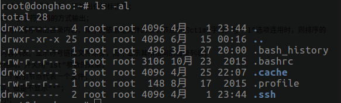
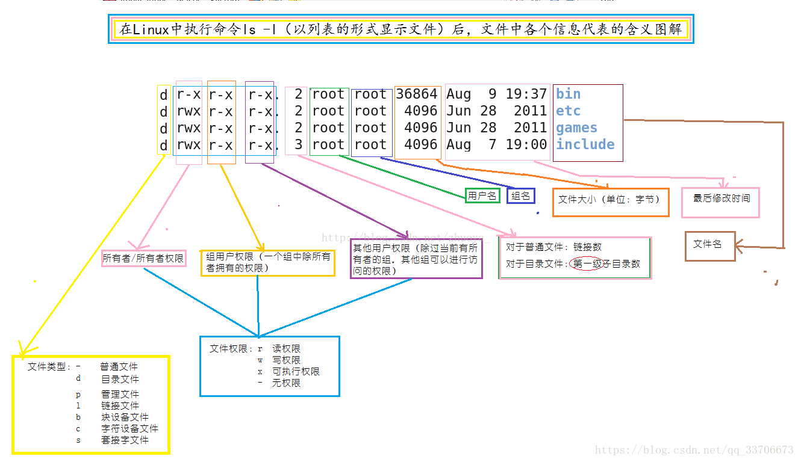
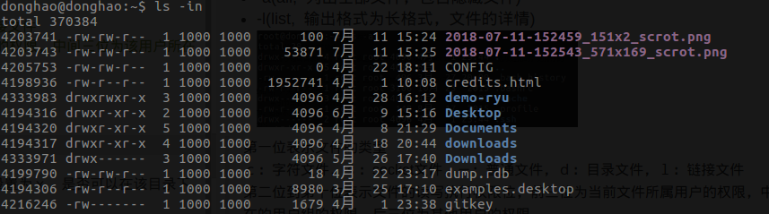
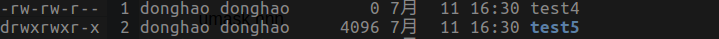
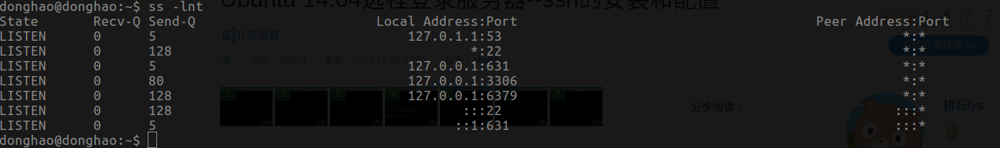
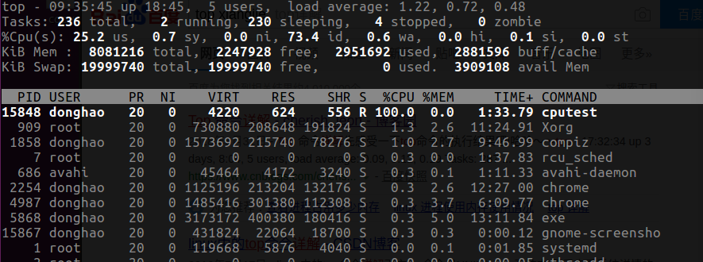
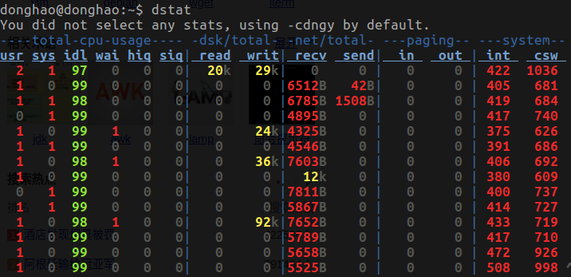
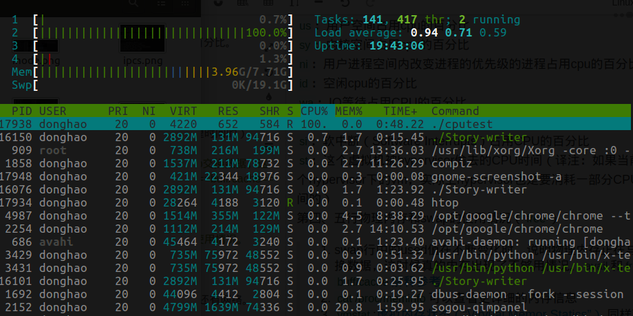
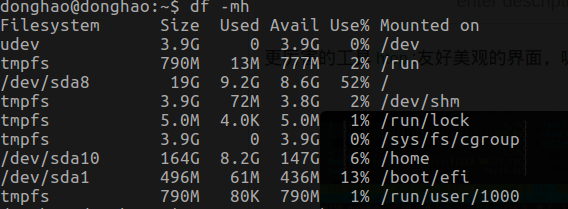
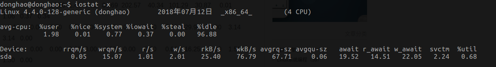

## 文件系统相关

 1. ==ls---list==:指定要显示列表的目录，也可以是具体的文件。
 
 - -a(all, 列出全部文件，包含隐藏文件)
 - -l(list, 输出格式为长格式，文件的详情)
 

>第一列第一位表示文件的类型
>ｃ：字符文件，ｓ：socket文件，－：普通文件，ｄ：目录文件，ｌ：链接文件
>第一列第二位到第十位表示文件的读写执行权限位，前三位为当前文件所属用户的权限，中间三位为该用户所在的用户组的权限，后三位为其他用户的权限。
>第二列：代表文件或者目录的链接数，即目录或者文件下还包含几个目录或者文件数

下面图片来源于网络，解释的较为清晰：

- -i(inode,  显示文件的inode值)
- -n(--numeric-uid-gid，list numeric user and group IDs)

- 思考:将一个目录的权限设置为rw，是否可以进入目录;将一个目录的权限设置为ｘ，是否可以在该目录下建立新文件？

 2. 文件的创建：==touch filename==;文件夹的创建==mkdir -p filename/1/2==

 3. 设置创建文件的指定权限掩码：==umask nnn== or ==umask u=,g=w,o=rwo==
 >利用umask命令可以指定哪些权限将在新文件的默认权限中被删除。例如，可以使用下面的命令创建掩码，使得组用户的写权限，其他用户的读、写和执行权限都被取消:
 >例如：==umask 002==:所对应的文件和目录创建缺省权限分别为6 6 4和7 7 5

 >==umask (-S)==:查看当前的权限掩码

4. 变更文件（目录）的权限：==chmod==
>常见的两种命令形式：==chmod u+x,o-x filename==; ==chmod 664 filename==

5. 变更文件（目录）的所有者和所属组：==chown  -R new的所属者　filename==
>-R : 对目前目录下的所有档案与子目录进行相同的拥有者变更(即以递回的方式逐个变更)

6. 查看文件内容：==cat/less/more/head/tail filename==
>查看文件的第4行到7行之间的内容:head -n 7 filename | tail -n 4
>==cat >> filename==:向文件后面追加内容

7. 查找文件：==locate which find==
>==locate==:locate命令其实是find -name的另一种写法，但是要比后者快得多，原因在于它不搜索具体目录，而是搜索一个数据库/var/lib/locatedb，这个数据库中含有本地所有文件信息。Linux系统自动创建这个数据库，并且每天自动更新一次，所以使用locate命令查不到最新变动过的文件。为了避免这种情况，可以在使用locate之前，先使用==updatedb==命令，手动更新数据库。
>==which==:用于查找并显示给定命令的绝对路径,==which ls==
>==find==:在指定的目录查找文件，用法较广，不细说。==find /home -name "*.txt"==

8. 其他常见的命令:
>删除：==rm==，一旦删除了一个文件，就无法再恢复它
>拷贝：==cp==;==scp==(远程拷贝)
>移动位置：==mv== , 也可以重命名。
>==tree==:以树形结构显示当前目录下的文件;==pstree==:打印进程关系树

9.压缩与解压缩命令:

10.重要工具==lsof==(list open file)

## 网络相关的命令
1. 假设场景为通过ssh登录失败如何排查
>查看当前网卡的状态：==ifconfig==
>查看网络的联通性:==ping host/域名/ip==
>查看是否是因为22端口否开放,可以先尝试利用==telnet ip==远程登录，==telnet==采用明文传送报文，安全性不好。
>正常的ssh登录一般命令：==ssh user@host -p 22==

2. 网络抓包:==tcpdump==

实例利用tcpdump分析三次握手，四次挥手过程

3. 网络系统的状态信息:==netstat==
>-c或--continuous：持续列出网络状态
>-s或--statistice：显示网络工作信息统计表
>-t或--tcp：显示TCP传输协议的连线状况
>-l或--listening：显示监控中的服务器的Socket

实例利用netstat分析TIME_WAIT状态

4. 用来显示处于活动状态的套接字信息:==ss==
>-l:显示处于监听状态的套接字;-t:只显示tcp套接字;-n:不解析服务名称，以数字方式显示

由Recv-Q和Send-Q状态的含义引发的思考，==ss==获取到的 ==Recv-Q/Send-Q== 在 LISTEN 状态以及非 LISTEN 状态所表达的含义是不同：
- 当socket处于listen状态的时候
>Recv-Q:表示全连接队列当前使用了多少，即当前等待服务器调用accept()取出的连接数量。
>Send-Q:表示全连接队列的最大值，由min(backlog,somaxconn)决定
- 当socket处于其它状态的时候
>Recv-Q:网络接受队列，表示接受到的数据己经在本地接收缓存了，但是还有多少没有被进程取走，recv()。如果Recv-Q一直不为０，说明可能遭受了拒绝服务 denial-of-service 攻击
>Send-Q:网络发送队列，表示数据已经被进程下发，但是对方并未返回ACK的数据包，要先保存在本地发送缓存区，send()。

5. 查看查询arp缓冲区中指定主机的arp条目:==arp==
6. 路由相关的协议：==route==;==tracepath==;

## 进程相关的命令
 
案例分析：当服务器出现卡吨，如何排查问题？{进程占用cpu和内存问题}
1. ==top==:多方信息监测系统性能和运行信息的实用工具

==top==显示的区域分为统计信息区和进程信息区。
统计信息区的说明
第一行：任务队列信息，与==uptime==命令执行的结果一致
依次为：系统当前时间；主机已经运行的时间；用户连接数（==who==）;
系统的平均负载，统计最近1,5,15分钟的系统平均负载。（如果高于逻辑cpu的数目就会超负载）
第二行：进程信息，依次为：进程总数；正在运行的进程；睡眠的进程；停止的进程数；僵尸进程数。
第三行：cpu信息
==us==：用户空间占用cpu的百分比
==sy==：内核空间占用cpu的百分比
==ni==：用户进程空间内改变进程的优先级的进程占用cpu的百分比。
==id==：空闲cpu的百分比
==wa==：IO等待占用CPU的百分比
==hi==：硬中断（Hardware IRQ）占用CPU的百分比
==si==：软中断（Software Interrupts）占用CPU的百分比
==st==：这个虚拟机被hypervisor偷去的CPU时间（译注：如果当前处于一个hypervisor下的vm，实际上hypervisor也是要消耗一部分CPU处理时间的）
第四、五行物理内存和swap的使用情况（==free==）
>1. swap行中的used值在不断变化时，说明物理内存正在与swap交换数据，这时候真的内存出现了不够用情况。==avail==和==free==和==buff/cache==[解释参考](https://www.jb51.net/article/135410.htm)
>2. ==cat /proc/meminfo==可以查看更详细的内存信息
>3. ==vmstat==:[虚拟内存状态（“Viryual Memor Statics”）](http://man.linuxde.net/vmstat),同样可以显示内存，I/O，cpu的使用情况。

进程信息区的说明：
==PID==：进程ID，进程的唯一标识符
==USER==：进程所有者的实际用户名。
==PR==：进程的调度优先级。这个字段的一些值是'rt'。这意味这这些进程运行在实时态。
==NI==：进程的nice值（优先级）。越小的值意味着越高的优先级。负值表示高优先级，正值表示低优先级
==VIRT==：进程使用的虚拟内存。进程使用的虚拟内存总量，单位kb。VIRT=SWAP+RES
==RES==：驻留内存大小。驻留内存是任务使用的非交换物理内存大小。进程使用的、未被换出的物理内存大小，单位kb。RES=CODE+DATA
==SHR==：SHR是进程使用的共享内存。共享内存大小，单位kb
==S==：这个是进程的状态（需要详细了解）。它有以下不同的值:
>D - 不可中断的睡眠态。
R – 运行态
S – 睡眠态
T – 被跟踪或已停止
Z – 僵尸态

==%CPU==自从上一次更新时到现在任务所使用的CPU时间百分比。
==%MEM==：进程使用的可用物理内存百分比。
==TIME+==：任务启动后到现在所使用的全部CPU时间，精确到百分之一秒。
==COMMAND==：运行进程所使用的命令。进程名称（命令名/命令行）

备注：==top==使用过程中常用的技术
>1. 输入１：列出全部的CPU使用情况
>2. 输入Ｐ：根据CPU使用百分比大小进行排序；
>3. 输入M：根据驻留内存大小进行排序；
>4. 输入f：从当前显示中添加或者删除项目

更厉害的工具==dsta==:结合的==vmstat==和==iostat==，还有网络。

更厉害的工具==htop==:友好美观的界面，吸引人。

2. ==ps==:查看当前系统的进程相关信息
常用的命令为==ps -aux==和==ps -ef==

3. ==kill==:向进程发生信号，==kill -l==:显示信号的类型；==kill -9 pid==:无条件的杀死pid进程。
4. 重写　==/proc/sys/vm/drop-caches==释放内存资源，（释放内存前的一个好习惯是将当前缓存同步到磁盘==sync==）

5. cpu亲和技术

6. ==oom killer== 

7. 调整进程优先级==nice==;==renice==

### 磁盘相关的命令

1. 报告文件系统整个磁盘空间的使用情况==df -mh==

更多的信息参考==cat /proc/diskstats==
2. 对文件和目录磁盘使用的空间的查看==du filename== 
>==sudo du -smh /tmp/*==　以易读的形式显示文件夹占用磁盘空间的总和。

3. 测试磁盘读写速度
==iostat -x==:显示当前系统磁盘IO情况。
[参数详解](http://blog.163.com/xychenbaihu@yeah/blog/static/132229655201332394953688/)

==dd==:测试磁盘读写的速度
>测试磁盘写：==sudo time dd  if=/dev/zero of=/tmp/test bs=50K count=12000==

>测试磁盘读：==sudo time dd  if=/dev/sda1 of=/dev/null bs=50K count=12000==

>同时测试磁盘读写：==sudo time dd  if=/dev/sda1 of=/tmp/text2 bs=50K count=12000==

1. linux中的磁盘调度算法以及调优

2. 硬链接和软链接的区别