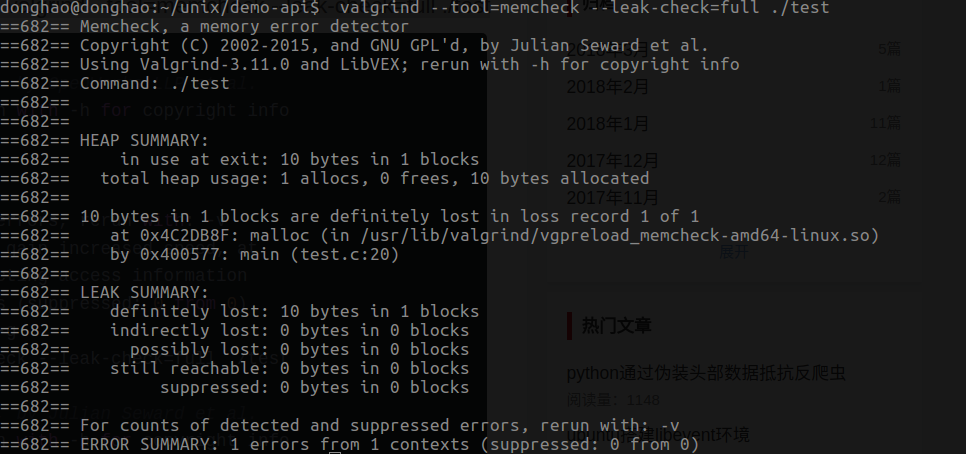
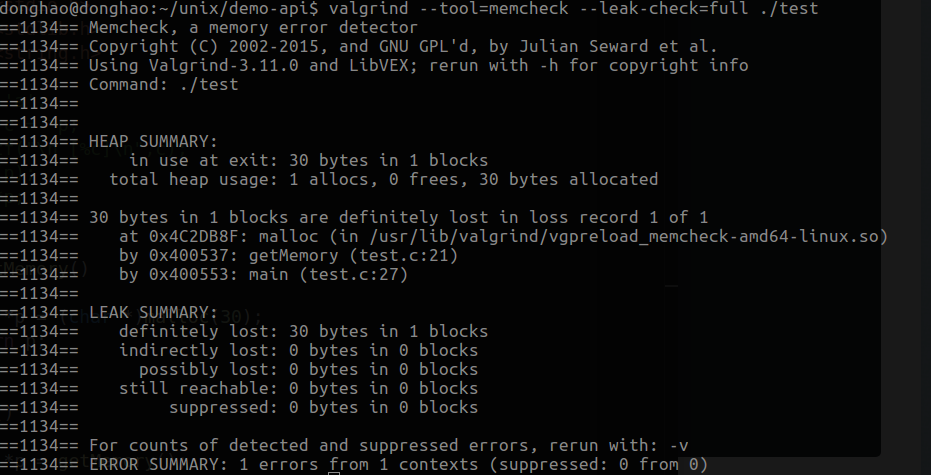
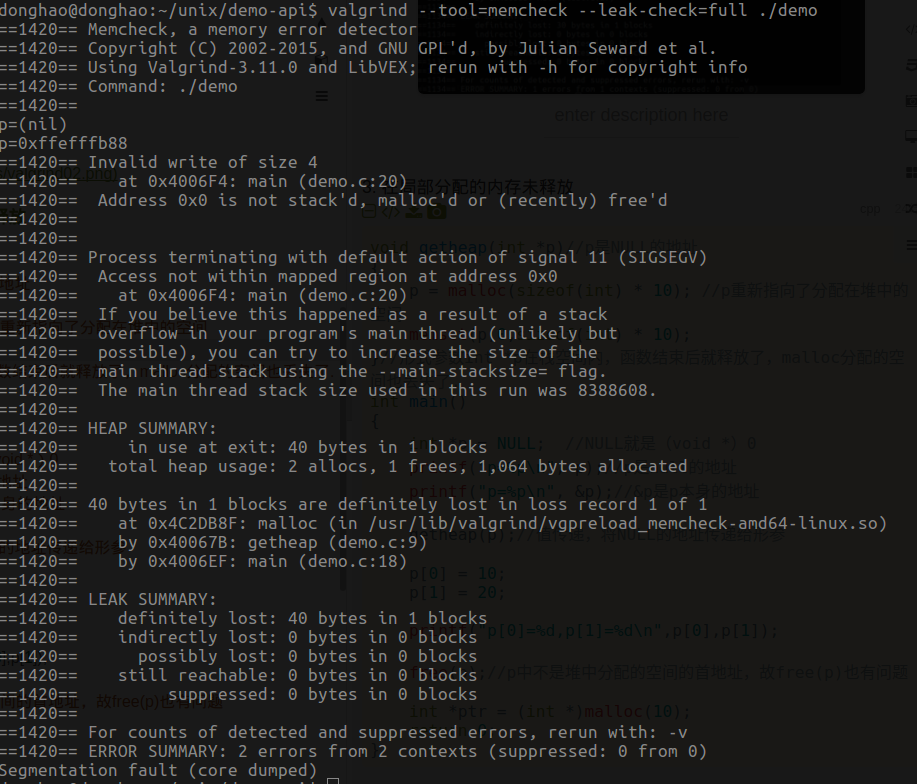

### 内存泄漏（memory leakage）概述

定义：在编写应用程序的时候，程序分配了一块内存，但已经不再持有引用这块内存的对象（通常是指针），虽然这些内存被分配出去，但是无法收回，将无法被其他的进程所使用，我们说这块内存泄漏了，被泄漏的内存将在整个程序声明周期内都不可使用。
主要原因：是在使用==new==或==malloc==动态分配堆上的内存空间，而并未使用==delete==或==free==及时释放掉内存。

### 内存泄漏的场景

#### 1. ==malloc==和==free==未成对出现

``` cpp
{
    char *p=(char *)malloc(sizeof(char) *10);
    memset(p,0,sizeof(char)*10);
　  ...
    return 0;
}
```
上面的程序在编译，运行阶段都没有问题，但是由malloc分配的内存去无法回收。可以利用valrind定位内存泄漏的原因，如图用malloc分配了10 bytes内存，但是并未回收，==valgrind --tool=memcheck --leak-check=full ./test==



#### 2. 通过局部分配的内存，未在调用者函数体内释放

这种错误在大型代码中会常常放，而且出现问题不容易定位，因为内存分配与释放是在不同的函数体内。
``` cpp
char* getMemory()
{
	char *p = (char *)malloc(30); 
	return p;
}
 
int main()
{
	char *p = getMemory();
	
	return 0;
}
```


在函数调用者的内部正确释放内存，代码如下。
``` cpp
char* getMemory()
{
	char *p = (char *)malloc(30); 
	return p;
}
 
int main()
{
	char *p = getMemory();

	if(p != NULL)
    {
        free(p);
        p=NULL;
    }
	return 0;
}
```



#### 3. 在局部分配的内存未释放

``` cpp
void getheap(int *p)//p是NULL的地址
{
	p = malloc(sizeof(int) * 10); //p重新指向了分配在堆中的空间
    memset(p,0,sizeof(int) * 10);
}//形式参数int *p在栈空间内，函数结束后就释放了，malloc分配的空间也丢失了.  
int main()
{
	int *p = NULL;  //NULL就是（void *）0
	printf("p=%p\n", p);//p是null的地址
	printf("p=%p\n", &p);//&p是p本身的地址
 
	getheap(p);//值传递，将NULL的地址传递给形参
 
	p[0] = 10;//相当与给NULL指针赋值
	p[1] = 20;
	printf("p[0]=%d,p[1]=%d\n",p[0],p[1]);	
	
	free(p);//p中不是堆中分配的空间的首地址，故free(p)也有问题
    //int *ptr = (int *)malloc(10);
    return 0;
}
```
程序在编译阶段并未报错，当时会出现段错误（内存未能正确被访问，如访问位初始化的指针，访问已经释放的指针变量，数组越界等），可以使用gdb调试coredump定位错误原因。


上述代码中，在函数==getheap==中分配的内存，但并未能得到释放，当该函数返回时，因为未返回分配的内存的首地址，所以程序将失去对这块内存的控制。



#### 4. 由于程序运行时出现不可遇见的错误，导致内存泄漏。

``` cpp
int fun1()
{
    p = malloc(sizeof(int) * 10); 
    fun2();
    ...
    free(p);
}
```
上述代码段在运行中时，若fun2内部出现错误，但是==free==函数不能正常执行，所以出现的内存泄漏的情况。

### c++中内存泄漏情况

