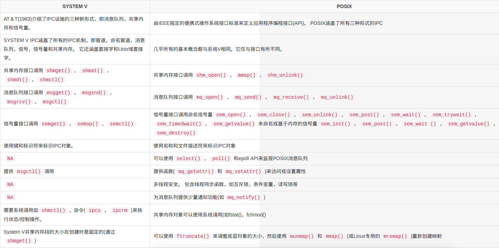
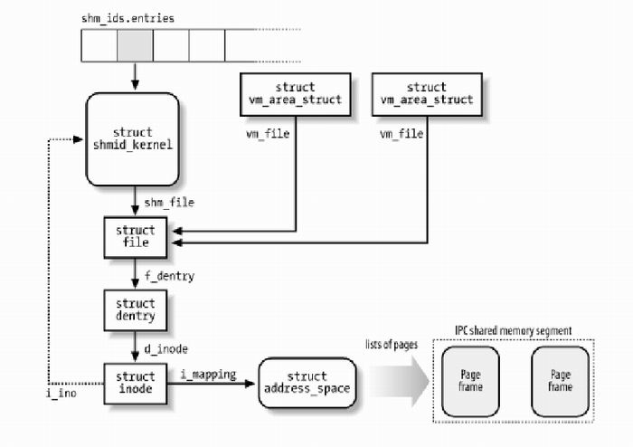
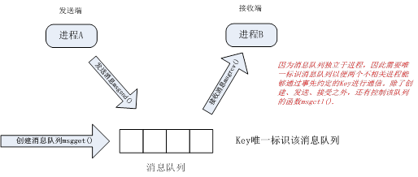
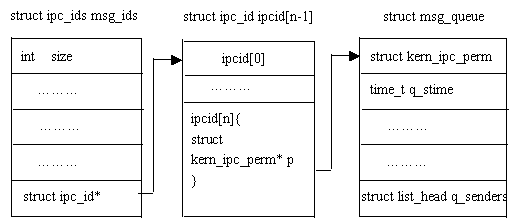
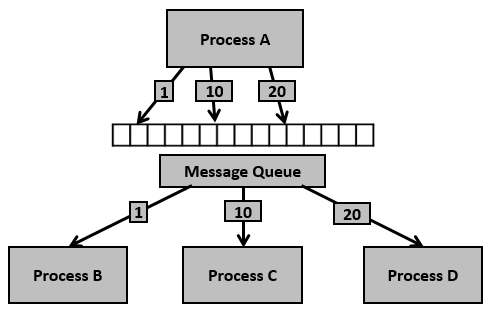
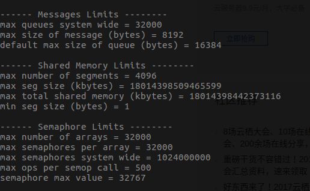

### 进程通信的概念

- IPC:每个进程都有自己独立的进程地址空间，任何在一个经常的全局变量在另一个进程中是看不见的，所以进程之间的数据交换是通过内核缓冲区实现的，一个进程先将数据从用户态拷贝到内核的缓冲区，然后另一个进程从内核缓冲区读取到用户态。内核提供的这种机制叫作进程间的通信（IPC：InterProcessCom
- System V IPC 与 POSIX IPC：
>1. System V IPC存在时间比较老，许多系统都支持，但是接口复杂，并且可能各平台上实现略有区别（如ftok的实现及限制），以为都是基于systemV IPC函数实现的。
>2. POSIX是新标准，现在多数UNIX也已实现，我觉得如果只是开发的话，那么还是POSIX好，因为语法简单，并且各平台上实现都一样。

### IPC之匿名管道

 1. 实现：调用pipe函数，在内核中开辟一块缓冲区（称为管道），一端连接进程的输入，另一端连接进程的输出。
 
 2. 匿名管道用于具有==血缘关系==的进程之间通信
>管道的读写端是通过打开的描述符来传递的，要通信的两个进程要从公共祖先那里继承管道文件描述符。通过fork传递文件描述符使得两个进程能够访问同一管道，才能实现通信。

 3. 匿名管道具有==单向通信==特征，只能由父进程读入，子进程写出，或者反过来。要想实现双向通信，必须使用两个管道。
 
 4. linux 的命令 ‘|’是一种管道实例
 
 5. `int pipe(int pipefd[2])`的man描述：
>  pipe()  creates  a  pipe,  a unidirectional data channel that can be used for interprocess communication.  The array pipefd is used to return two file descriptors referring to the ends of the pipe. pipefd[0]  refers  to the  read  end  of the pipe.  pipefd[1] refers to the write end of the pipe.  Data written to the write end of the pipe is buffered by the kernel until it is read from the read end of the pipe.  For further  details,  see pipe(7).
 6. 代码实例：
 
``` c
#include <sys/types.h>
#include <sys/wait.h>
#include <stdio.h>   
#include <stdlib.h>
#include <unistd.h>
#include <string.h>

int main(int argv, char **argc)
{
	int pipefd[2];
	int ret;
	if((ret = pipe(pipefd))<0)
	{
		printf("pipe error! \n");
		exit(-1);
	}
	pid_t pid;
	pid = fork();
	if(pid<0)
	{
		printf("fork error! \n");
		exit(-1);
	}
	else if(pid == 0)
	{
		char wbuff[10]="hello";
		close(pipefd[0]);  //关闭读文件描述符
		printf("I am child,who write.\n");
		write(pipefd[1],wbuff,sizeof(wbuff));
		close(pipefd[1]);
	}
	else 
	{
		char rbuff[15];
		close(pipefd[1]);   //关闭写文件描述符
		printf("I am parent,who can read.\n");
		int n;
		if(n=read(pipefd[0],rbuff,sizeof(rbuff))>0)
		printf("parent has got :%s\n from child",rbuff);
		close(pipefd[0]);
	}
	return 0;
}
```
 7. ==管道实现的细节==：在linux中并未给管道实现专门的数据结构，借助与文件系统的file结构和VFS的索引节点inode，通过将两个file结构指向同一个临时的VFS索引节点，而这个VFS索引节点又指向一个物理页面而实现的。
 8. 在read、write为阻塞IO函数操作下，以下几点需要注意的：
 >- 当写文件描述符都关掉时，若有进程仍从读端读取数据时，当将剩余数据都读取完成后，read返回0,类似与读到文件的末尾(EoF)。
 >- 写端没有关闭，读端读取完管道的数据后，再次读会出现阻塞
 >- 读端关闭，写端还一直在写数据，收到信号SIGPIPE，导致写进程终止。
 >- 读未关闭，但是未读取数据，写端写满缓冲区时，再次写，就会阻塞。
 
### IPC之命名管道
1. 解决的问题：匿名管道只能实现两个具有血缘关系的进程之间的通信，为了打破这种限制，提出有名管道，也叫命名管道（name pipe or FIFO），同时也适用于双工通信。
2. 创建命名管道的系统函数有两个：mknod和mkfifo，两个函数均定义在头⽂件sys/stat.h

``` cpp
#include <sys/types.h> 
#include <sys/stat.h> 
int mknod(const char *path,mode_t mod,dev_t dev); 
int mkfifo(const char *path,mode_t mode);
```
3. 深入理解：FIFO (First in, First out)为一种特殊的文件类型，它在文件系统中有对应的路径。当一个进程以读(r)的方式打开该文件，而另一个进程以写(w)的方式打开该文件，那么内核就会在这两个进程之间建立管道，所以FIFO实际上也由内核管理，不与硬盘打交道。之所以叫FIFO，是因为==管道本质上是一个先进先出的队列数据结构==，最早放入的数据被最先读出来，从而保证信息交流的顺序。FIFO只是借用了文件系统(file system,命名管道是一种特殊类型的文件，因为Linux中所有事物都是文件，它在文件系统中以文件名的形式存在。)来为管道命名。写模式的进程向FIFO文件中写入，而读模式的进程从FIFO文件中读出。当删除FIFO文件时，管道连接也随之消失。FIFO的好处在于我们可以通过==文件的路径来识别管道，从而让没有亲缘关系的进程之间建立连接==。
4. 代码实现（包含fifo_server.c和fifo_client.c）

``` cpp:fifo_server.c
#include <stdio.h>
#include <sys/stat.h>
#include <sys/types.h>
#include <fcntl.h>
#include <unistd.h>
#include <string.h>
#include <stdlib.h>

int main() 
{
    int fd;
    char readbuf[80];
    char end[10];
    int to_end;
    int read_bytes;
    int res;
    /* Create the FIFO if it does not exist */
    // my_fifo文件类型将是pipe类型
    const char *fifo_name = "/tmp/my_fifo";
    res = mkfifo(fifo_name, 0777); 
    if(res != 0)  
    {  
        fprintf(stderr, "Could not create fifo %s\n", fifo_name);  
        exit(-1);  
    }  
    strcpy(end, "end");
    while(1) {
       fd = open(fifo_name, O_RDONLY);
       read_bytes = read(fd, readbuf, sizeof(readbuf));
       readbuf[read_bytes] = '\0';
       printf("Received string: \"%s\" and length is %d\n", readbuf, (int)strlen(readbuf));
       to_end = strcmp(readbuf, end);
       if (to_end == 0) {
           close(fd);
           break;
       }
    }
    return 0;
}

``` cpp:fifo_client
#include <stdio.h>
#include <sys/stat.h>
#include <sys/types.h>
#include <fcntl.h>
#include <unistd.h>
#include <string.h>

int main() {
    int fd;
    int end_process;
    int stringlen;
    char readbuf[80];
    char end_str[5];
    const char *fifo_name = "/tmp/my_fifo";  
    printf("FIFO_CLIENT: Send messages, infinitely, to end enter \"end\"\n");
    fd = open(fifo_name, O_CREAT|O_WRONLY);
    strcpy(end_str, "end");
 
    while (1) {
        printf("Enter string: ");
        fgets(readbuf, sizeof(readbuf), stdin);
        stringlen = strlen(readbuf);
        readbuf[stringlen - 1] = '\0';
        end_process = strcmp(readbuf, end_str);

        //printf("end_process is %d\n", end_process);
        if (end_process != 0) {
            write(fd, readbuf, strlen(readbuf));
            printf("Sent string: \"%s\" and string length is %d\n", readbuf, (int)strlen(readbuf));
        } else {
            write(fd, readbuf, strlen(readbuf));
            printf("Sent string: \"%s\" and string length is %d\n", readbuf, (int)strlen(readbuf));
            close(fd);
            break;
        }
    }
    return 0;
}
```
5. 可以使用`mkfifo mypipe`创建一个命名管道，命名管道的内容驻留在内存中而不是被写到硬盘上。数据内容只有在输入输出端都打开时才会传送。用户可以在管道的输出端打开之前向管道多次写入。通过使用命名管道，用户可以创建一个进程写入管道并且另外一个进程读取管道的流程，而不用关心协调二者时间上的同步。参考：[命名管道](https://linux.cn/article-9314-1.html)，
5. 当读未打开的时候，多个写都会阻塞在fifo文件，当读打开时候，写进程会竞争写入的顺序，写入的数据不超过PIPE_BUF,可以保证原子操作。

6. 为了数据的安全，我们很多时候要采用阻塞IO函数的FIFO，让写操作变成原子操作。防止多个写进程同时对FIFO文件操作。
>怎样才能使写操作原子化呢？答案很简单，系统规定：在一个以O_WRONLY（即阻塞方式）打开的FIFO中， 如果写入的数据长度小于等待PIPE_BUF，那么或者写入全部字节，或者一个字节都不写入。如果所有的写请求都是发往一个阻塞的FIFO的，并且每个写记请求的数据长度小于等于PIPE_BUF字节，系统就可以确保数据决不会交错在一起。

### IPC之共享内存
1. 实现原理：系统V通过映射特殊文件系统shm中的文件实现进程间的共享内存通信，即每个共享内存区域对应特殊文件系统shm中的一个文件（通过shmid_kernel结构联系起来的）,进程间需要共享的数据被放在一个叫做IPC共享内存区域的地方，所有需要访问该共享区域的==进程都要把该共享区域映射到本进程的地址空间==中去。好处是==降低整体内存占用率==。
2. 系统V共享内存API
- shmge函数:==`int shmget(key_t key, size_t size, int shmflg)`==
系统V共享内存通过shmget获得或创建一个IPC共享内存区域，并返回相应的标识符。内核在保证shmget获得或创建一个共享内存区，初始化该共享内存区相应的shmid_kernel结构注同时，还将在特殊文件系统shm中，创建并打开一个同名文件，并在内存中建立起该文件的相应dentry及inode结构，新打开的文件不属于任何一个进程（任何进程都可以访问该共享内存区）。
- shmat函数：==`void * shmat(int shmid, const void *shmaddr, int shmflg)`==
把共享内存区域映射到调用进程的地址空间去，这样进程就可以实现方便地对共享区域进行访问操作
- shmdt函数：==`int shmdt(const void *shmaddr)`==
解除进程对共享内存区域的映射
- shmctl函数：==`int shmctl(int shmid, int cmd, struct shmid_ds *buf)`==
实现对共享内存区域的控制操作
3. linux系统中关于共享内存的参数
- 查看系统内核单个共享内存段最大字节数： ==`cat /proc/sys/kernel/shmmax`==
- 查看系统范围内最大共享内存区标识符数： ==`cat /proc/sys/kernel/shmmni`==
4. 系统V共享内存机制与mmap()映射普通文件的区别
5. 利用==ipcs==可以查看当前系统中存在的[消息队列、共享内存、信号量的情况](https://www.jianshu.com/p/04ee6fae9a3d)。
6. cat查看不到共享内存（shm文件系统中的文件内容）：cat不属于可以共享内存的进程。
7. 代码实现：

``` cpp：shm_write.c
#include<stdio.h>
#include<stdlib.h>
#include <sys/ipc.h>
#include <sys/shm.h>
#include<string.h>
#include<errno.h>

typedef struct _Teacher
{
    char name[64];
    int age;
}Teacher;

int main(int argv, char *argc[])
{

    int ret = 0;
    int    shmid;
    key_t key;
    char *name = "/dev/shm/myshm2";
    /*
    *ftok建立key_t ftok(const char *pathname, int proj_id);
    *目的：唯一标识共享内存（文件系统shm中的文件）
    *在一般的UNIX中，通常是将文件的索引节点取出，然后在前面加上子序号就得到key_t的值。
    */
    key = ftok(name, 0);
    if (key == -1)
    {
        perror("ftok error");
    }
    /*
    * 系统调用将创建或分配一个System V共享内存段
    * IPC_CREAT(创建新段),4096:PAGE_SIZE的倍数的共享内存段的大小,key：识别共享内存段
    * 调用会在成功时返回一个有效的共享内存标识符
    */
    //创建共享内存 ，相当于打开文件，文件不存在则创建
    shmid = shmget(key, sizeof(Teacher), IPC_CREAT | 0666); 
    if (shmid == -1)
    {
        perror("shmget err");
        return errno;
    }
    printf("shmid:%d \n", shmid);
    Teacher *p = NULL;
    //将共享内存段连接到进程地址空间
    p = shmat(shmid, NULL, 0);//第二个参数shmaddr为NULL，核心自动选择一个地址
    if (p == (void *)-1 )
    {
        perror("shmget err");
        return errno;
    }

    int i;
    char temp='a';
    for(i=0;i<5;i++)
    {
        temp += 1;
        memcpy(((p + i)->name), &temp, 1);
        (p+i)->age = 20+i; 
    }
    //将共享内存段与当前进程脱离
    shmdt(p);
        
    printf("键入1 删除共享内存，其他不删除\n");
    int num;
    scanf("%d", &num);
    if (num == 1)
    {
        //用于控制共享内存
        ret = shmctl(shmid, IPC_RMID, NULL);//IPC_RMID为删除内存段
        if (ret < 0)
        {
            perror("rmerrr\n");
        }
    }                 

    return 0;    
}

``` cpp:shm_read.c
#include <stdio.h>
#include <stdlib.h>
#include <sys/ipc.h>
#include <sys/shm.h>
#include <string.h>
#include <errno.h>
#include <unistd.h>
typedef struct _Teacher
{
    char name[64];
    int age;
}Teacher;

int main(int argv, char *argc[])
{
    int ret = 0;
    int   shmid;
    key_t key;
    char *name = "/dev/shm/myshm2";
    key = ftok(name, 0);
    if(key==-1)
        perror("ftok error");
    shmid = shmget(key, 0, 0);
    //shmid = shmget(0x2234, sizeof(Teacher), IPC_CREAT |IPC_EXCL | 0666); 
    //打开获取共享内存
    if(shmid==-1)
    {
        perror("shmget error");
        return 0;
    }
    printf("shmid:%d \n", shmid);
    Teacher *p = NULL;
    //将共享内存段连接到进程地址空间
    p = shmat(shmid, NULL, 0);
    if (p == (void *)-1 )
    {
        perror("shmget err");
        return errno;
    }
    int i=0;
    for(i=0;i<5;i++)
    {
       printf("name:%s\n",(*(p+i)).name);
       //printf("age:%d\n",(*(p_map+i)).age);
       //printf("name:%s\n",((p_map+i)->name));
       printf("age:%d\n",((p+i)->age));
    }
    //将共享内存段与当前进程脱离
    shmdt(p);
                
    return 0;
}
```
8. 深入理解： 内核通过数据结构==struct ipc_ids shm_ids==维护系统中的所有共享内存区域，==shm_ids.entries==变量指向一个==ipc_id==结构数组，而每个==ipc_id==结构数组中有个指向==kern_ipc_perm==结构的指针。到这里读者应该很熟悉了，对于系统V共享内存区来说，==kern_ipc_perm==的宿主是==shmid_kernel==结构，==shmid_kernel==是用来描述一个共享内存区域的，这样内核就能够控制系统中所有的共享区域。同时，在==shmid_kernel==结构的file类型指针==shm_file==指向文件系统shm中相应的文件，这样，共享内存区域就与shm文件系统中的文件对应起来。


9. 与mmap()实现的共享内存机制对比，参考：[共享内存](https://www.ibm.com/developerworks/cn/linux/l-ipc/part5/index2.html?ca=drs-)

### IPC之消息队列
1. 实现原理; 消息队列是由消息的==链表==，存放在内核中并由消息队列标识符标识。消息队列克服了信号传递信息少、管道只能承载无格式字节流以及缓冲区大小受限等缺点。



2. 系统V消息队列API
- msgget函数：==int msgget(key_t, key, int msgflg)==
创建一个消息队列或连接到一个已经存在的消息队列，调用会在成功时返回一个有效的消息队列标识符(用于进一步调用消息队列)
- msgsnd函数：==int msgsnd(int msgid, const void *msgp, size_t msgsz, int msgflg)==
将消息发送/附加到消息队列(System V)中
- msgrcv函数：==int msgrcv(int msgid, const void *msgp, size_t msgsz, long msgtype, int msgflg)==
从消息队列中接受数据包
- msgctl函数：==int msgctl(int msgid, int cmd, struct msqid_ds *buf)==
参数cmd是对消息队列执行所需控制操作的命令
3. 代码实现：可以实现多个shell终端执行==msgq_send.c==同时发送，但是多个==msgq_recv.c==不能同时接受，每次只能一个进程接受到，接受进程之间出现了竞争数据关系，消息队列数据被一个进程读取后，就不再队列保持了。（要想不同的进程处理接受到的不同类型的消息，可以利用父进程接受，然后分发到子进程。或者按照==mtype==类型不同进程读取不同的消息）

``` cpp：msgq_send.c
#include <stdio.h>
#include <string.h>
#include <stdlib.h>
#include <errno.h>
#include <string.h>
#include <sys/types.h>

#include <sys/ipc.h>
#include <sys/msg.h>

#define PERMS 0644
typedef struct my_msgbuf {
   long mtype;
   char mtext[200];
} msgbuf;

int main(int argv,char **argc)
{
    msgbuf buff;
    int msgqid;
    int len;
    key_t key;

    system("touch msgq.txt");
    if ((key = ftok("msgq.txt", 'B')) == -1) {
        perror("ftok");
        exit(1);
    }

    if((msgqid=msgget(key,PERMS | IPC_CREAT))==-1){
        perror("msgget");
        exit(1);
    }

    printf("message queue: ready to send messages.\n");
    printf("Enter lines of text, ^D to quit:\n");

    buff.mtype = 1; /* we don't really care in this case */
    //当输入ctrl+D，结束循环
    //fgets从参数stream所指的文件内读入字符并存到参数s所指的内存空间，
    //直到出现换行字符、读到文件尾或是已读了size-1个字符，最后会加上NULL作为字符串结束。
    while(fgets(buff.mtext,sizeof(buff.mtext),stdin)!=NULL)
    {
        len = strlen(buff.mtext);
        /* remove newline at end, if it exists */
        if (buff.mtext[len-1] == '\n') buff.mtext[len-1] = '\0';

        if(msgsnd(msgqid,&buff,len+1,0)==-1)
            perror("msgsnd");
    }
    //发送end消息
    strcpy(buff.mtext,"end");
    len = strlen(buff.mtext);
    if(msgsnd(msgqid,&buff,len+1,0)==-1)
            perror("msgsnd");
    //IPC_RMID - 立即删除消息队列    
    if(msgctl(msgqid,IPC_RMID,NULL)==-1){
        perror("msgctl");
        exit(1);
    }
    printf("message queue: done sending messages, and closed.\n");
    return 0;
}

``` cpp：msgq_recv.c
#include <stdio.h>
#include <string.h>
#include <stdlib.h>
#include <errno.h>
#include <string.h>
#include <sys/types.h>

#include <sys/ipc.h>
#include <sys/msg.h>

#define PERMS 0644
typedef struct my_msgbuf {
   long mtype;
   char mtext[200];
} msgbuf;

int main(int argv,char **argc)
{
    msgbuf buff;
    int msgqid;
    int len;
    key_t key;

    if ((key = ftok("msgq.txt", 'B')) == -1) {
        perror("ftok");
        exit(1);
    }

    if((msgqid=msgget(key,PERMS))==-1){
        perror("msgget");
        exit(1);
    }

    printf("message queue: ready to recv messages.\n");
    while(1)
    {
        //如果msgtype是0 - 读取队列中的第一个收到的消息
        if(msgrcv(msgqid,&buff,sizeof(buff),0,0)==-1)
        {
            perror("msgrcv");
        }
        printf("recvd: \"%s\"\n", buff.mtext);
        if((strcmp("end",buff.mtext))==0)
        break;
    }
    printf("message queue: done receiving messages.\n");
    system("rm msgq.txt");
    return 0;
}
```
4. 深入理解：==struct ipc_ids msg_ids==是内核中记录消息队列的全局数据结构；==struct msg_queue==是每个消息队列的队列头。从图中可以看出全局数据结构==struct ipc_ids msg_ids== 可以访问到每个消息队列头的第一个成员：==truct kern_ipc_perm==；而每个struct kern_ipc_perm能够与具体的消息队列对应起来是因为在该结构中，有一个key_t类型成员key，而==key则唯一确定一个消息队列==。系统建立IPC通讯（如消息队列、共享内存时）必须指定一个ID值，通常情况下，该id值通过ftok函数得到（基于inode唯一性）。



5. 多进程读写同一个队列
>- Q:多进程同时从一个消息队列中取消息，都以阻塞的方式，从消息队列中顺序取消息，但是多进程同时取的时候我没有加锁，不知道这样会不会出现什么问题？操作系统应该对进程有个排队的操作吧？
A:不会有什么问题，==OS保证操作的原子性==，即不可能出现一条消息被几个进程各收取一部分的情况。但具体是哪个进程收到消息则是随机的.
>- Q:在多个子进程同时向一个消息队列写时要不要进行互斥操作？
A:消息队列是个队列，送进去的消息会排队，所以不会有“同一个消息”的情况,==不必互斥==。
>- 读操作是根据==mtype==来区分不同的消息的，当某个消息写入后，如果读进程退出了，这个消息会堵在消息队列里，多了就会造成消息队列堵塞，任何进程写消息队列都会失败，造成系统的不可用，这时要注意读、写进程的配合，这也是用消息队列最不爽的地方!
6. 通过一个进程用不同的数据包写入共享存储器，并通过多个进程，即按照消息类型读出：


7. 消息队列、信号量、共享内存操作实战
- 显示当前Linux系统中的共享内存段、信号量集、消息队列等的使用情况：==ipcs -l==


### IPC之信号量

1. why 信号量：==保护多个进程共享的关键/公共区域==
2. 信号量分类：
- 二进制信号 - 只有两个状态0和1，即锁定/解锁或可用/不可用，互斥实现。
- 计算信号量 - 允许任意资源计数的信号量称为计数信号量。
3. 信号量的工作原理：
- 信号量只支持两种操作：等待和发送信号，即==P(sv)==和==V(sv)==
- ==P(sv)==：如果sv的值大于零，就给它减1；如果sv的值为零，就挂起该进程的执行。
- ==V(sv)==：如果有其他进程因等待sv而被挂起，就让它恢复运行，如果没有进程因等待sv而挂起，就给它加1.
- 实例：就是两个进程共享信号量sv，一旦其中一个进程执行了`P(sv)`操作，它将得到信号量，并可以进入临界区，使sv减1。而第二个进程将被阻止进入临界区，因为当它试图执行`P(sv)`时，sv为0，它会被挂起以等待第一个进程离开临界区域并执行`V(sv)`释放信号量，这时第二个进程就可以恢复执行。
4. 信号量API
- semget函数： ==int semget(key_t key, int num_sems, int sem_flags)==
创建一个新信号量或是取得一个已有的信号量
- semop函数：==int semop(int sem_id, struct sembuf *sem_opa, size_t num_sem_ops)==
改变信号量的值
``` 
struct sembuf{
    short sem_num; // 除非使用一组信号量，否则它为0
    short sem_op; //信号量在一次操作中需要改变的数据，通常是两个数，一个是-1，即P（等待）操作， 一个是+1，即V（发送信号）操作。
    short sem_flg; // 通常为SEM_UNDO,使操作系统跟踪信号，
                  //并在进程没有释放该信号量而终止时，操作系统释放信号量
};
```
- semctl函数：==int semctl(int sem_id, int sem_num, int command, ...)==
该函数可以直接控制信号量信息。


### IPC之信号

